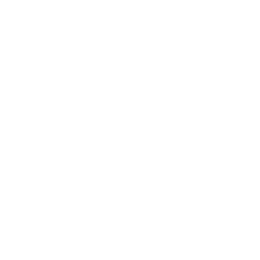

# LogisticsBoy
A Foundry VTT Module to automatically create a default set of item roll tables for use with StockBoy and LootBoy

## Compatible Game Systems
- Pathfinder 2e

## Installation

- Go to your foundry instance's ***Configuration and Setup*** page
- Click the ***Add-on Modules*** Tab
- Click the ***Install Module*** button
- Option 1: Automatic Installation:
    - Search for ***RPG.Tools: Module***
    - Click the ***Install*** button included in the package description
- Option 2: Manual Installation:
    - Copy and paste the following link into the ***Manifest URL*** field: https://github.com/jdip/rpg-tools-logistics-boy/releases//latest/download/module.json
    - Click the ***Install*** button next to the ***Manifest URL*** field
- Load your foundry world
- Go to the ***Game Settings*** tab
- Click the ***Manage Modules*** button
- Make sure the box next to **RPG.Tools: Module** is checked
- Click the ***Save Module Settings*** button

## Details

- Adds a new ***Module*** button in the ***Rollable Tables*** tab
- Generated tables will be placed in a 'Module' folder in the Rollable Tables tab
- You can edit the tables to your heart's content after generation, but re-generating will wipe out any custom changes.
- Both [StockBoy](https://github.com/jdip/rpg-tools-stock-boy) and [LootBoy](https://github.com/jdip/rpg-tools-loot-boy) will recognize these tables and make them available to use when generating loot.
- Currently Available Tables:
    - Alchemist (potions, poisons, bombs, etc.)
    - Arcanist (scrolls, wands, robes, etc.)
    - Armor: Hard (metal armor)
    - Armor: Soft (leather & cloth armor)
    - Clothing (mundane non-protective clothing)
    - Oddities (all magic items not found in other tables)
    - Shields (shields & accessories)
    - Treasure (precious non-magical items such as gems & rare metals)
    - Weapons: Melee
    - Weapons: Ranged
- The generated tables are heavily weighted against both high level & high rarity items

## Credits
- Foundry VTT Types courtesy of [foundryvtt/pf2e](https://github.com/foundryvtt/pf2e) under [Apache 2.0](http://www.apache.org/licenses/LICENSE-2.0)
- Hand Truck icon () courtesy of [Delapouite](https://delapouite.com/) under [CC BY 3.0](http://creativecommons.org/licenses/by/3.0/)
